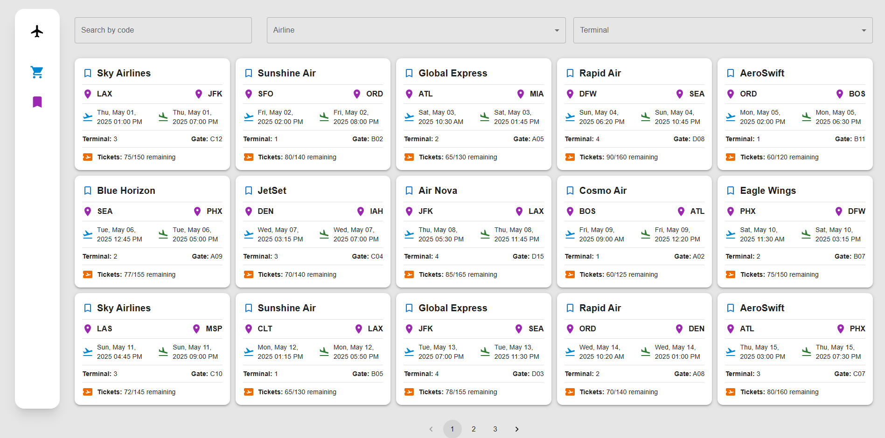

# This a test task for Antonov

To make this repository yours:

```
rm -rf .git && git init && npm init
git add .
git commit -m "Initial commit"
```

### Screenshot



Includes the following libraries:

- `@tanstack/react-query`
- `axios`
- `tailwind`
- `classnames`
- `tailwind-merge`
- `eslint` and the libraries for the airbnb config
- `prettier`

## How to use

Install dependencies:

```
npm install
```

Start the local server:

```
npm run dev
```
